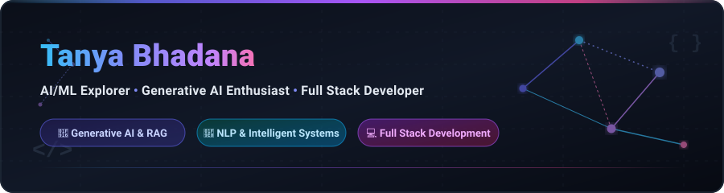

<!-- HEADER BANNER -->

  

# Hi there, I'm Tanya Bhadana 👋

### 🤖 AI/ML Explorer • Generative AI Enthusiast • Full Stack Developer

  

## 📌 About Me

I am a **BTech Computer Science Engineering** student at **KIET**, focused on building intelligent systems and scalable software.

- 🧠 **AI & LLM Focused**: I work on Generative AI and Large Language Model (LLM) applications, with an emphasis on Retrieval-Augmented Generation (RAG), Natural Language Processing (NLP), and intelligent systems.
- 💻 **Full-Stack Capability**: Beyond AI models, I build full-stack web applications, working across both frontend and backend technologies to deliver complete solutions.
- 🚀 **Practical Application**: I enjoy turning conceptual ideas into practical, real-world applications that solve actual problems.
- 🏆 **Continuous Growth**: I actively participate in projects and hackathons while continuously refining my problem-solving, DSA, and software engineering skills.

---

## 🎯 Currently Focused On

- 🤖 **Generative AI & LLM Applications**: Building intelligent prompt-driven systems and agentic workflows.
- 🔎 **Retrieval-Augmented Generation (RAG)**: Engineering robust context retrieval for document Q&A.
- 🧠 **NLP & Intelligent Systems**: Processing text, embeddings, entity extraction, and sentiment analysis.
- 💻 **Full Stack AI Applications**: Integrating AI models with intuitive web interfaces.
- ⚙️ **Backend & API Development**: Designing clean, performant APIs and database interactions.
- 🚀 **Practical AI/ML Projects**: Translating machine learning techniques into functional software.
- 📚 **Data Structures & Algorithms**: Strengthening core problem-solving and algorithmic skills.
- 🌐 **DevOps & Workflows**: Exploring deployment pipelines, containerization, and automated workflows.

  

## 🛠️ Tech Stack

### 💻 Languages

  
  
  
  

### 🧠 AI & Machine Learning

  
  
  
  

### 🤖 Generative AI

  
  
  

### 🌐 Web Development

  
  
  
  
  

### ⚙️ Backend

  
  
  
  

### 🗄️ Databases

  
  

### 🛠️ Tools & DevOps

  
  
  
  
  
  

  

## 🚀 Featured Projects

### 🔬 ResearchRAG
A Retrieval-Augmented Generation system engineered for academic and research question answering. Retrieves relevant context from research documents and uses an LLM to generate precise, grounded answers.

`Python` • `FAISS` • `Sentence Transformers` • `LangChain` • `Groq` • `Streamlit`

👉 **[View Repository](https://github.com/Tanya-kiet/ResearchRAG)**

---

### 🧠 PSAF — Prompt Stability Analysis Framework
A framework designed to analyze the stability, consistency, and variance of LLM responses across different prompts and model configurations.

`Python` • `Groq` • `OpenAI` • `Google Gemini` • `Sentence Transformers` • `Scikit-learn`

👉 **[View Repository](https://github.com/Tanya-kiet/PSAF-Prompt-Stability-Analysis-Framework)**

---

### 🎯 HireSmart AI
An AI-powered resume screening and job matching platform featuring automated resume analysis, category prediction, candidate ranking, and job-description matching.

`Python` • `FastAPI` • `Machine Learning` • `TF-IDF` • `Scikit-learn` • `React`

👉 **[View Repository](https://github.com/Tanya-kiet/HireSmart-AI)**

---

### 🏗️ Sanrachna
An AI-powered construction planning and management application developed in a hackathon context to streamline structural project workflows.

`Python` • `React` • `FastAPI` • `Generative AI` • `Machine Learning`

👉 **[View Repository](https://github.com/Tanya-kiet/Sanrachna)**

  

## 📊 GitHub Statistics

  

---

## 🐍 Contribution Activity

  

  

## 🤝 Connect With Me

  

## 🤝 Connect With Me

 

  <i>"Building intelligent systems at the intersection of AI, Machine Learning, and Software Engineering."</i>

